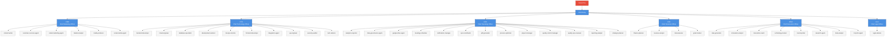

# MFM Corporation Organization Chart (Mermaid)

```mermaid
graph TD
    Owner[Owner/You]
    CEO[CEO Remy]
    
    CMO[CMO<br/>Chief Marketing Officer]
    CTO[CTO<br/>Chief Technology Officer]
    COO[COO<br/>Chief Operating Officer]
    CFO[CFO<br/>Chief Financial Officer]
    CINO[CINO<br/>Chief Innovation Officer]
    CLO[CLO<br/>Chief Legal Officer]
    
    %% CMO Team
    CW[content-writer]
    CS[customer-success-agent]
    EM[email-marketing-agent]
    MA[market-analyst]
    MP[media-producer]
    SM[social-media-agent]
    
    %% CTO Team
    BD[backend-developer]
    CE[cloud-engineer]
    DS[database-specialist]
    DA[development-advisor]
    DM[devops-monitor]
    FD[frontend-developer]
    IA[integration-agent]
    QE[qa-engineer]
    SA[security-auditor]
    TA[tech-advisor]
    
    %% COO Team
    AR[analytics-reporter]
    DG[data-governance-agent]
    GD[google-drive-agent]
    MS[meeting-scheduler]
    NM[notification-manager]
    OC[ops-coordinator]
    PG[pdf-generator]
    PO[process-optimizer]
    PM[project-manager]
    QCM[quality-control-manager]
    QOR[quality-ops-reviewer]
    RA[reporting-analyst]
    SP[strategic-planner]
    
    %% CFO Team
    FP[finance-planner]
    RV[revenue-analyst]
    RS[risk-assessor]
    GT[grant-tracker]
    
    %% CINO Team
    IG[idea-generator]
    IA2[innovation-analyst]
    IC[innovation-coach]
    TT[technology-tracker]
    TS[trend-spotter]
    RA2[research-agent]
    DA2[data-analyst]
    MLA[mcp-llm-agent]
    
    %% CLO Team
    LA[legal-advisor]
    
    %% Connections
    Owner --> CEO
    CEO --> CMO
    CEO --> CTO
    CEO --> COO
    CEO --> CFO
    CEO --> CINO
    CEO --> CLO
    
    %% CMO Team Connections
    CMO --> CW
    CMO --> CS
    CMO --> EM
    CMO --> MA
    CMO --> MP
    CMO --> SM
    
    %% CTO Team Connections
    CTO --> BD
    CTO --> CE
    CTO --> DS
    CTO --> DA
    CTO --> DM
    CTO --> FD
    CTO --> IA
    CTO --> QE
    CTO --> SA
    CTO --> TA
    
    %% COO Team Connections
    COO --> AR
    COO --> DG
    COO --> GD
    COO --> MS
    COO --> NM
    COO --> OC
    COO --> PG
    COO --> PO
    COO --> PM
    COO --> QCM
    COO --> QOR
    COO --> RA
    COO --> SP
    
    %% CFO Team Connections
    CFO --> FP
    CFO --> RV
    CFO --> RS
    CFO --> GT
    
    %% CINO Team Connections
    CINO --> IG
    CINO --> IA2
    CINO --> IC
    CINO --> TT
    CINO --> TS
    CINO --> RA2
    CINO --> DA2
    CINO --> MLA
    
    %% CLO Team Connections
    CLO --> LA
    
    %% Styling
    classDef executive fill:#4a90e2,stroke:#2c5aa0,stroke-width:2px,color:#fff
    classDef team fill:#f5f5f5,stroke:#999,stroke-width:1px
    classDef owner fill:#e74c3c,stroke:#c0392b,stroke-width:2px,color:#fff
    
    class Owner owner
    class CEO,CMO,CTO,COO,CFO,CINO,CLO executive
    class CW,CS,EM,MA,MP,SM,BD,CE,DS,DA,DM,FD,IA,QE,SA,TA,AR,DG,GD,MS,NM,OC,PG,PO,PM,QCM,QOR,RA,SP,FP,RV,RS,GT,IG,IA2,IC,TT,TS,RA2,DA2,MLA,LA team
```
